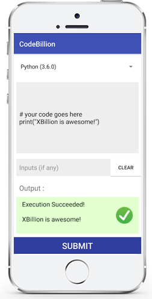
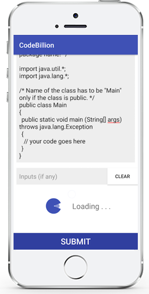

# Code Billion App

Problem Statement:
	Build an Android application to edit code in different languages and run the code
	on a remote online compiler, while displaying any output if present.
	 User should have the option to enter input values to the above coded program.

## Getting Started

* Get the app by [downloading the debug-demo apk here](https://github.com/asadkhan777/CodeBillion/blob/master/app-debug-demo-2017_05_02.apk)

## Built With

* [Retrofit](https://github.com/square/retrofit) - Type-safe HTTP client for Android and Java by Square, Inc.
* [OkHttp](https://github.com/square/okhttp) - An HTTP+HTTP/2 client for Android and Java applications.
* [RxJava2](https://github.com/ReactiveX/RxJava) - RxJava – Reactive Extensions for the JVM.
* [Dagger2](https://github.com/google/dagger) - A fast dependency injector for Android and Java.
* [Butterknife](https://github.com/JakeWharton/butterknife) - Bind Android views and callbacks to fields and methods.
* [AVLoadingIndicatorView](https://github.com/81813780/AVLoadingIndicatorView) - a collection of nice loading animations for Android.
* [Maven](https://maven.apache.org/) - Dependency Management

## Authors

* **Asad Khan** - [CodeBillion](https://github.com/asadkhan777/CodeBillion)

## Acknowledgments

* Hat tip to anyone who's code was used
* Inspiration
* etc
